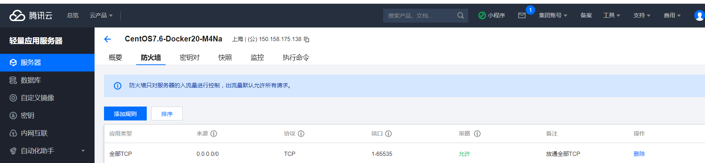
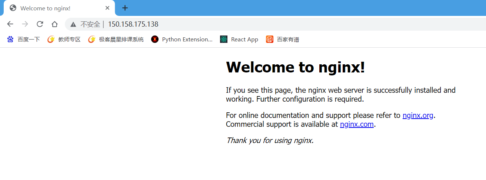
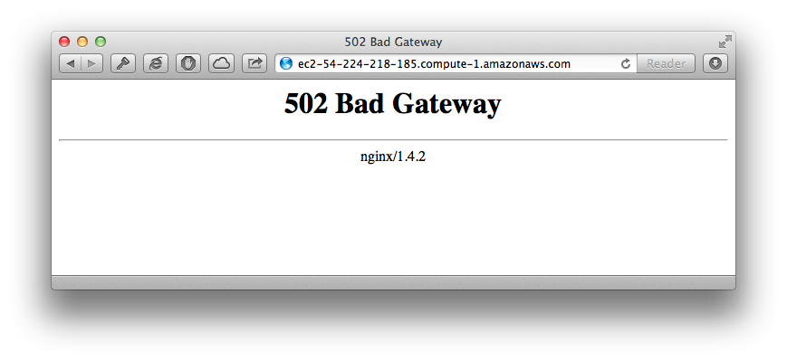
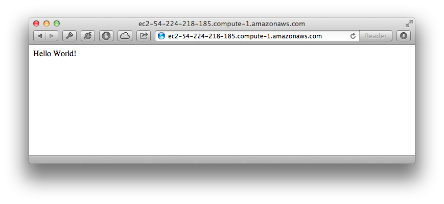

# GeekSWB
使用腾讯云部署过程
操作系统：Ubuntu Server 18.04.1 LTS 64bit
外网地址：150.158.175.138

##前提条件
在腾讯云控制台添加TCP所有端口或者需要开放端口的访问权。

系统Ubuntu默认拒绝root用户ssh远程登录，需要修改文件/etc/ssh/sshd_config
注释掉这行：PermitRootLogin prohibit-password
然后新建一行 添加：PermitRootLogin yes
重启服务
```shell
sudo service ssh restart
```
将： PasswordAuthentication no 修改为PasswordAuthentication yes
重启ssh服务 ，
```shell
service sshd restart
```


使用apt-get安装Nginx的话，我们需要添加Nginx库到apt-get source中：
```shell
sudo add-apt-repository ppa:nginx/stable
```

在我们开始安装Nginx及其他所需软件之前先安装一些前提软件。首先，
我们需要PIP与virtualenv：
```shell
sudo apt-get install python-setuptools
wget https://bootstrap.pypa.io/ez_setup.py -O - | python
sudo easy_install pip==20.2.4
sudo pip install virtualenv
```

升级已有的包，确保系统上有uWSGI所需的编译器和工具：
```shell
sudo apt-get update && sudo apt-get upgrade
sudo apt-get install build-essential python python-dev
```

## Nginx
安装并运行Nginx：
```shell
sudo apt-get install nginx
sudo /etc/init.d/nginx start
```
Nginx是一个提供静态文件访问的web服务，然而，它不能直接执行
托管Python应用程序，而uWSGI解决了这个问题。让我们先安装uWSGI，
稍候再配置Nginx和uWSGI之间的交互。
```shell
sudo pip install uwsgi
```


## 里程碑一
打开浏览器访问你的服务器，你应该能看到Nginx欢迎页：


## 示例应用
我们应用是一个极客晨星的课程记录网站，将所有应用相关的文件存放在
/var/www/demoapp文件夹中。下面创建这个文件夹并在其中初始化一
个虚拟环境：
```shell
sudo mkdir /var/www/demoapp
```

由于我们使用root权限创建了这个文件夹，它目前归root用户所有，
让我们更改它的所有权给你登录的用户（我的例子中是ubuntu）
```shell
sudo chown -R ubuntu:ubuntu /var/www/demoapp/
```
创建并激活一个虚拟环境，在其中安装Flask：
```shell
cd /var/www/demoapp
virtualenv venv
. venv/bin/activate
pip install flask
```

然后使用finalShell导入我们的项目文件，或者从github拉去源码文件到demoapp下面
## 里程碑二
让我们执行我们刚创建的脚本：
```shell
python swbApp.py
```

现在你可以通过浏览器访问你服务器的5000端口，看，应用生效了：

注意：因为80端口已被Nginx使用，这里我使用5000端口。
现在应用是由Flask内置的web服务托管的，
对于开发和调试这确实是个不错的工具，但不推荐在生产环境中使用。
让我们配置Nginx来挑起这个重担吧。

## 配置Nginx
首先删除掉Nginx的默认配置文件：
```shell
sudo rm /etc/nginx/sites-enabled/default
```
注意：如果你安装了其他版本的Nginx，默认配置文件可能在/etc/nginx/conf.d文件夹下。

创建一个我们应用使用的新配置文件/var/www/demoapp/demoapp_nginx.conf：
```shell
server {
    listen      80;
    server_name localhost;
    charset     utf-8;
    client_max_body_size 75M;

    location / { try_files $uri @yourapplication; }
    location @yourapplication {
        include uwsgi_params;
        uwsgi_pass unix:/var/www/demoapp/demoapp_uwsgi.sock;
    }
}
```

将刚建立的配置文件使用符号链接到Nginx配置文件文件夹中，重启Nginx：
```shell
sudo ln -s /var/www/demoapp/demoapp_nginx.conf /etc/nginx/conf.d/
sudo /etc/init.d/nginx restart
```

## 里程碑三
访问服务器的公共ip地址，你会看到一个错误：


别担心，这个错误是正常的，它代表Nginx已经使用了我们新创建的配置文件，
但在链接到我们的Python应用网关uWSGI时遇到了问题。找到uWSGI的链接位置，
在nginx配置文件[/var/www/demoapp/demoapp_nginx.conf]的第10行定义：
```text
uwsgi_pass unix:/var/www/demoapp/demoapp_uwsgi.sock;
```
这代表Nginx和uWSGI之间的链接是通过一个socket文件，
这个文件位于/var/www/demoapp/demoapp_uwsgi.sock。
因为我们还没有配置uWSGI，所以这个文件还不存在，
因此Nginx返回“bad gateway”错误，让我们马上修正它吧。

## 配置uWSGI
创建一个新的uWSGI配置文件/var/www/demoapp/demoapp_uwsgi.ini：
```ini
[uwsgi]
#application's base folder
base = /var/www/demoapp

#python module to import
app = app
module = %(app)

home = %(base)/venv
pythonpath = %(base)

#socket file's location
socket = /var/www/demoapp/%n.sock

#permissions for the socket file
chmod-socket = 666

#the variable that holds a flask application inside the module imported at line #6
callable = app

#location of log files
logto = /var/log/uwsgi/%n.log
```


创建一个新文件夹存放uWSGI日志，更改文件夹的所有权：
```shell
sudo mkdir -p /var/log/uwsgi
sudo chown -R ubuntu:ubuntu /var/log/uwsgi
```


## 里程碑四
执行uWSGI，用新创建的配置文件作为参数：
```shell
uwsgi --ini /var/www/demoapp/demoapp_uwsgi.ini
```


我们现在基本完成了，唯一剩下的事情是配置uWSGI在后台运行，
这是uWSGI Emperor的职责。

## uWSGI Emperor
uWSGI Emperor (很拉风的名字，是不？) 负责读取配置文件
并且生成uWSGI进程来执行它们。创建一个初始配置来运行 emperor
创建这个文件/etc/init/uwsgi.conf：
```shell
description "uWSGI"
start on runlevel [2345]
stop on runlevel [06]
respawn

env UWSGI=/usr/local/bin/uwsgi
env LOGTO=/var/log/uwsgi/emperor.log

exec $UWSGI --master --emperor /etc/uwsgi/vassals --die-on-term --uid www-data --gid www-data --logto $LOGTO
```

最后一行运行uWSGI守护进程并让它到/etc/uwsgi/vassals文件夹查找配
置文件。创建这个文件夹，在其中建立一个到链到我们刚创建配置文件的符
号链接。
```shell
sudo mkdir /etc/uwsgi && sudo mkdir /etc/uwsgi/vassals
sudo ln -s /var/www/demoapp/demoapp_uwsgi.ini /etc/uwsgi/vassals
```

同时，最后一行说明用来运行守护进程的用户是www-data。为简单起见，
将这个用户设置成应用和日志文件夹的所有者。
```shell
sudo chown -R www-data:www-data /var/www/demoapp/
sudo chown -R www-data:www-data /var/log/uwsgi/
```

注意：我们先前安装的Nginx版本使用“www-data”这个用户来运行Nginx，
其他Nginx版本的可能使用“Nginx”这个替代用户。

由于Nginx和uWSGI都由同一个用户运行，我们可以在uWSGI配置中添加
一个安全提升项。打开uWSGI配置文件，将chmod-socket值由666更改为644：
```text
...
#permissions for the socket file
chmod-socket = 644
```

现在我们可以运行uWSGI了：就在这里失败了导致前功尽弃
```shell
sudo start uwsgi
```

最后，Nginx和uWSGI被配置成启动后立即对外提供我们的应用服务。

